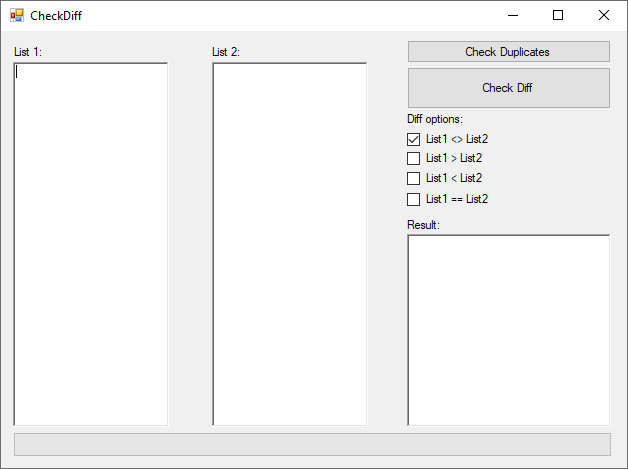

# cs-diff-check
A simple C# windows form program for comparing lists of text, ids etc.

It loops trough the lists and compares them line by line and outputs the difference selected in the diff options.

# How to use
- Copy lists in text field 1 and 2
- Select type of diff check
- Click on "Check diff"

## Sceenshot

